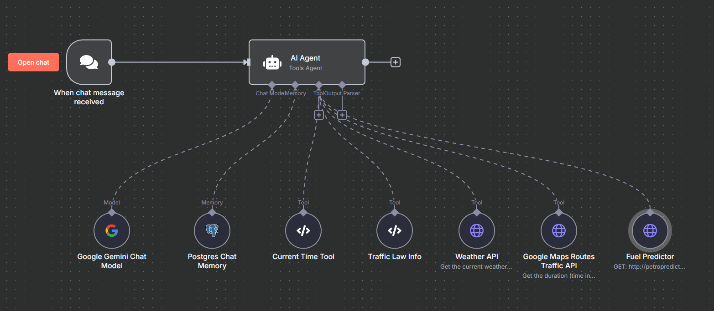

# Mashal-E-Rah

Mashal-E-Rah is a chatbot developed using [n8n](https://n8n.io/) that provides intelligent responses and real-time information using AI, external APIs, and custom code tools.

## Features

- **AI Agent**: Handles natural language understanding and response generation.
- **PostgreSQL Memory**: Stores conversation history and context using a PostgreSQL database.
- **Python Function Nodes**: Executes custom Python code for advanced logic and processing.
- **HTTP Request Nodes**: Fetches external data, including:
    - **Google Routes API**: Retrieves time duration required to travel between locations.
    - **Prophet Forecasting API**: Gets future fuel price predictions via a custom API built with [Prophet](https://facebook.github.io/prophet/) and exposed using [CherryPy](https://cherrypy.dev/).

## Architecture

- **n8n Workflow**: Orchestrates all chatbot logic and integrations. The workflow is saved as a `.json` file.
- **Dockerized Deployment**:
    - `n8n` runs in a Docker container.
    - `Prophet API` runs in a separate Docker container.
    - `PostgreSQL` uses a Docker named volume for persistent storage.

    ### N8N Workflow
    

## Getting Started

1. Clone the repository.
2. Start all services using Docker Compose.
3. Import the provided n8n workflow JSON file.
4. Configure environment variables and API keys as needed.

## Team

- **Team Name**: PakistanBot
- **Main Contributor**: Samir Bin Khalid

## License

This project is licensed under the MIT License.
